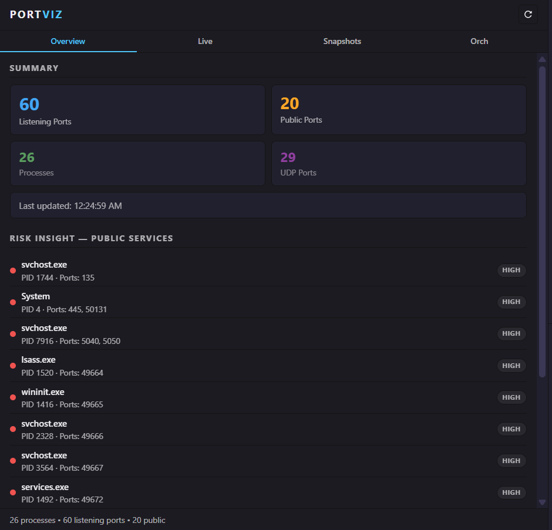
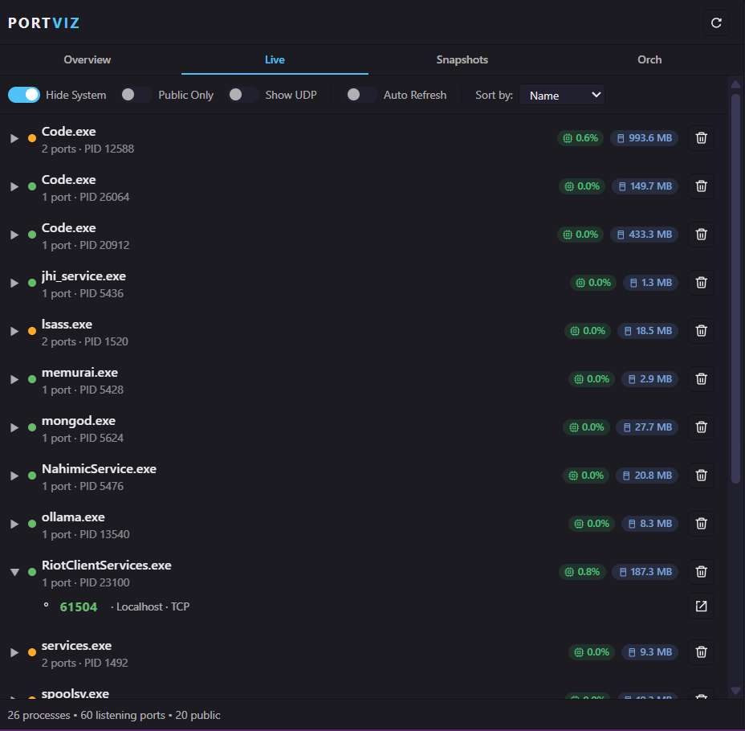
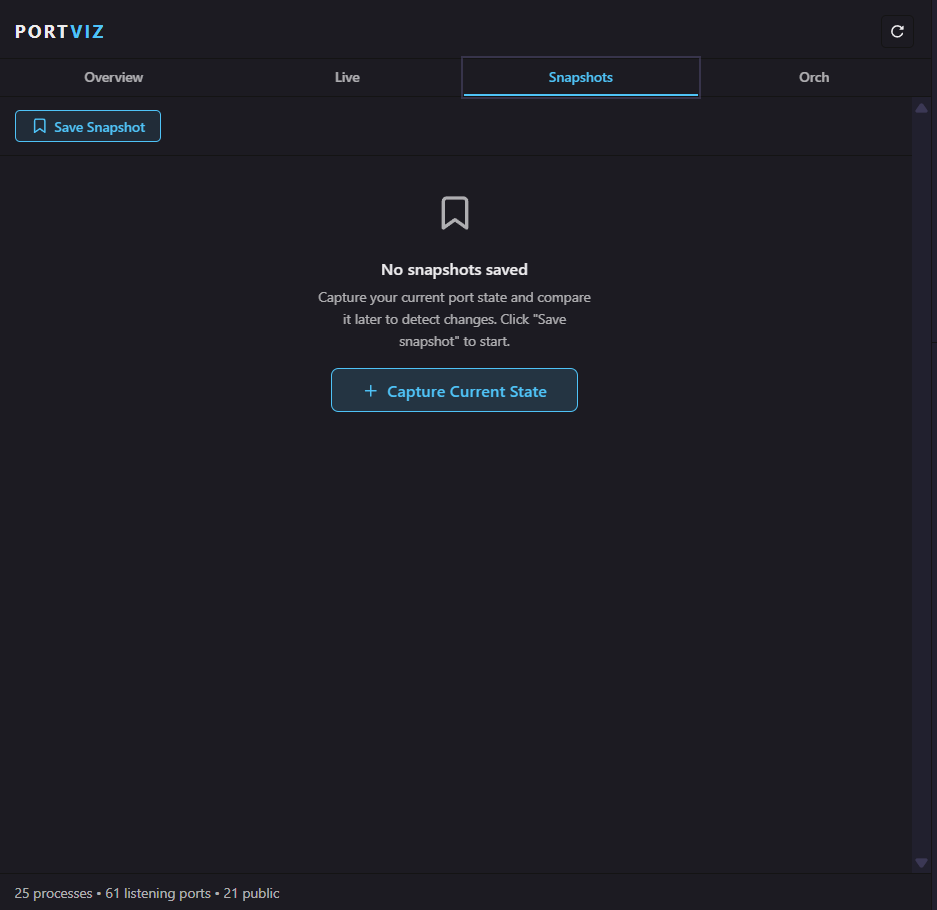
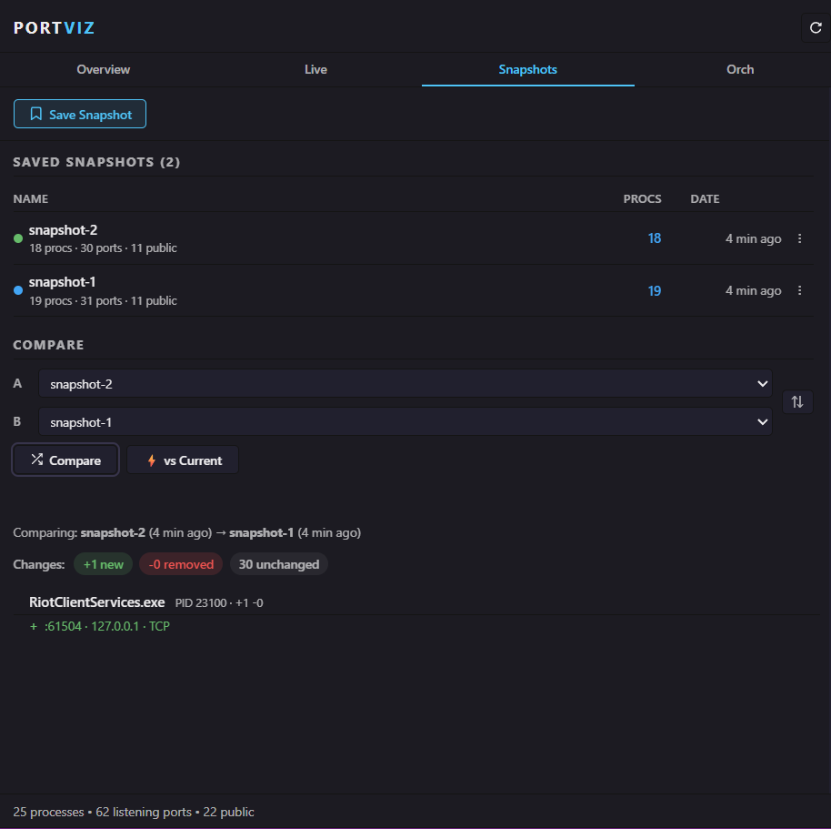
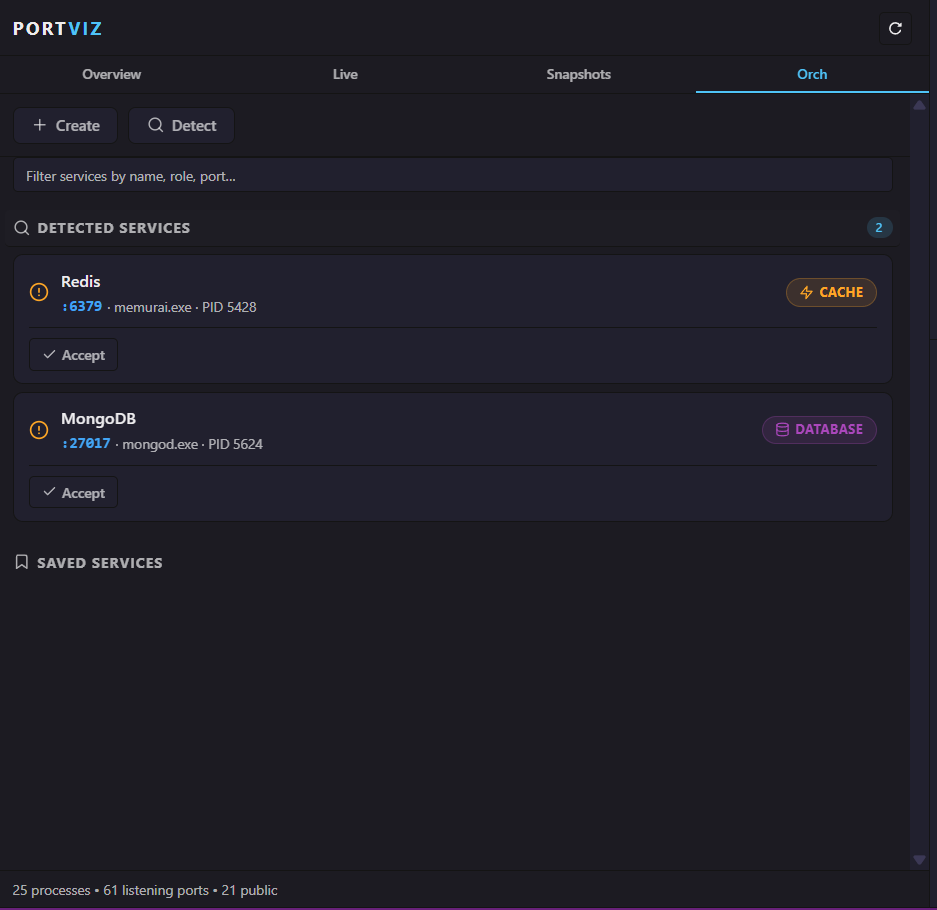
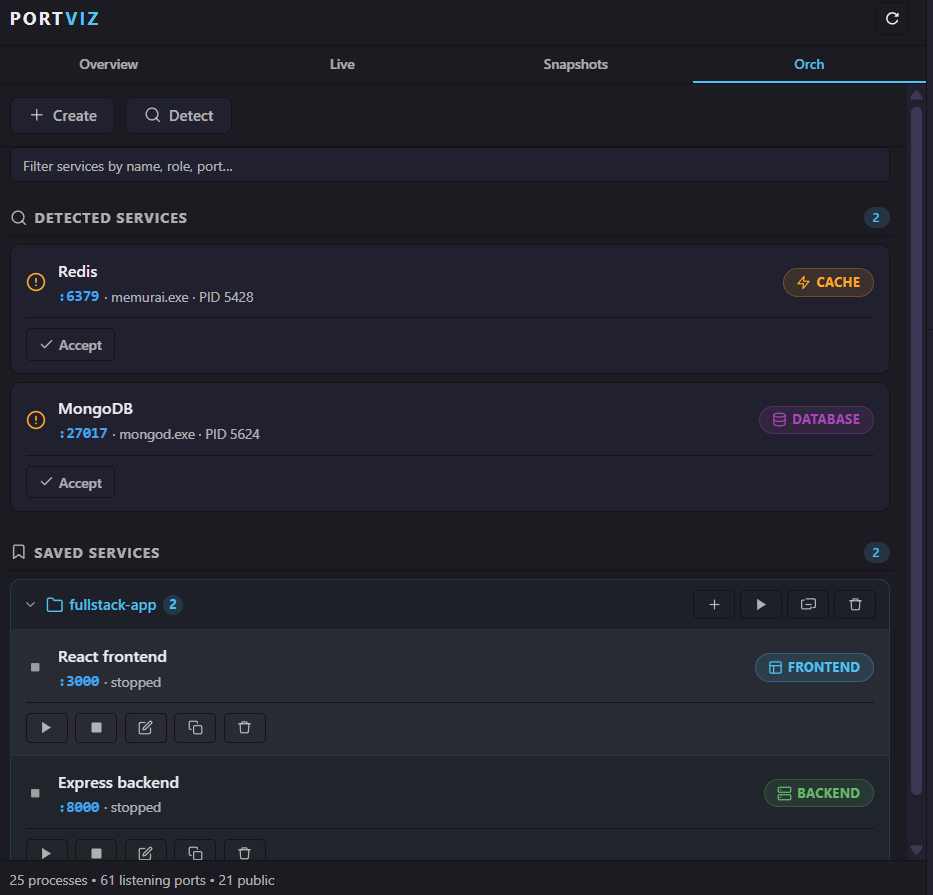
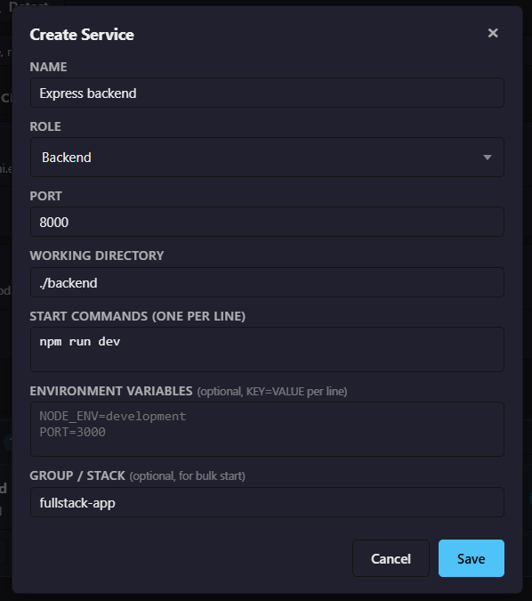

# Portviz – Port & Process Dashboard for VS Code

> Visualize listening ports, detect public exposure, snapshot environments, and orchestrate your dev stack – all without leaving VS Code.

## Features

### 1. Overview – At-a-glance risk & activity

- Total listening ports, UDP ports, and distinct processes.
- Public ports surfaced with a simple risk list.
- Quick sense of how "noisy" your machine is during development.

### 2. Live – Processes, ports, and resource usage

- Group ports by process with clear PID and port counts.
- One-click kill for a process (via Portviz CLI).
- "Open in Browser" for HTTP services on localhost.
- Filters:
  - Hide system processes
  - Public-only view
  - Show UDP
- Sort by name, PID, or port count.
- **Live resource badges** per process:
  - CPU% (color-coded: low / medium / high)
  - Memory usage (MB)
- Optional auto-refresh with configurable interval.

### 3. Snapshots – Capture and compare environments

- Save the current listening-port state with a friendly name.
- Snapshot card shows:
  - Total ports
  - Public ports
  - Distinct processes
- Compare two snapshots:
  - Ports added/removed
  - Grouped by process for easy reading.
- Compare any snapshot vs **Current** live state.

### 4. Orchestration – Manage your dev stack

- Detect likely dev services from live port data (framework and role heuristics).
- Save services with:
  - Name, role (frontend/backend/database/cache/custom)
  - Port, working directory
  - Start commands (one per line)
  - Optional env vars and group/stack name.
- Start/stop a single service or an entire stack group.
- Orchestration status reconciled from port state.

### 5. Notifications (optional)

- Alert when ports open/close.
- Extra warnings when services bind to `0.0.0.0` (public).
- Ability to watch specific ports and get notified when they come up or go down.

### 6. Cross-platform resource monitoring

- Windows: uses PowerShell (`Get-CimInstance`, `Get-Process`).
- macOS / Linux: uses `ps` for `%CPU` and RSS memory.
- No external dependencies beyond the Portviz CLI and standard system tools.

---

## Requirements

- **VS Code** 1.8x or newer (matches `engines.vscode` in `package.json`).
- **Portviz CLI** installed and on your PATH.
  - The extension shells out to `portviz report --json` and `portviz kill`.

---

## Commands

The extension contributes these commands:

- `portviz.refresh` – Refresh the Portviz dashboard data.

The main interaction point is the **Portviz Dashboard** view (side bar), not the command palette. The old `portviz.showReport` command is no longer exposed; everything flows through the dashboard.

---

## Settings

Search for **"Portviz"** in the VS Code Settings UI.

### Refresh & limits

- `portviz.autoRefreshInterval` (number, default: `5` seconds)
  - How often the Live tab auto-refreshes when enabled.
- `portviz.cliTimeout` (number, default: `15` seconds)
  - Timeout for the Portviz CLI calls.
- `portviz.serviceStartTimeout` (number, default: `30` seconds)
  - How long to wait for a dev service to start listening before marking as timed out.
- `portviz.maxSnapshots` (number, default: `15`)
  - Maximum number of snapshots to keep (oldest are pruned).

### Notifications

- `portviz.notifications.portOpened` (boolean, default: `false`)
  - Show an info toast when a new port starts listening.
- `portviz.notifications.portClosed` (boolean, default: `false`)
  - Show an info toast when a port stops listening.
- `portviz.notifications.publicPort` (boolean, default: `true`)
  - Show a warning when a port is opened on `0.0.0.0`.

### Resource Monitor

- `portviz.resourceMonitor.enabled` (boolean, default: `true`)
  - Enable the per-process CPU & memory polling.
- `portviz.resourceMonitor.refreshInterval` (number, default: `10` seconds)
  - Polling interval for resource data.

---

## Usage

1. **Open the Portviz Dashboard**
   - Open the **Ports / Portviz** view in the Activity Bar / Side Bar.

2. **Run your usual dev stack**
   - Start your servers (frontend, backend, DB, etc.) as normal.

3. **Refresh & inspect**
   - Click the **Refresh** button in the dashboard header or run `Portviz: Refresh`.
   - Use the **Overview** tab to see global counts and risk.
   - Use the **Live** tab to expand processes and see their ports and resources.

4. **Capture a snapshot**
   - Go to **Snapshots** tab.
   - Click **Save Snapshot** and name it (e.g. `before-deploy`).

5. **Compare environments**
   - Select any two snapshots (A & B) and press **Compare**.
   - Or compare a snapshot vs **Current** state.

6. **Orchestrate your stack**
   - Go to **Orch** tab.
   - Click **Detect** to see suggested services.
   - Save them, group them, and start or stop them from VS Code.
